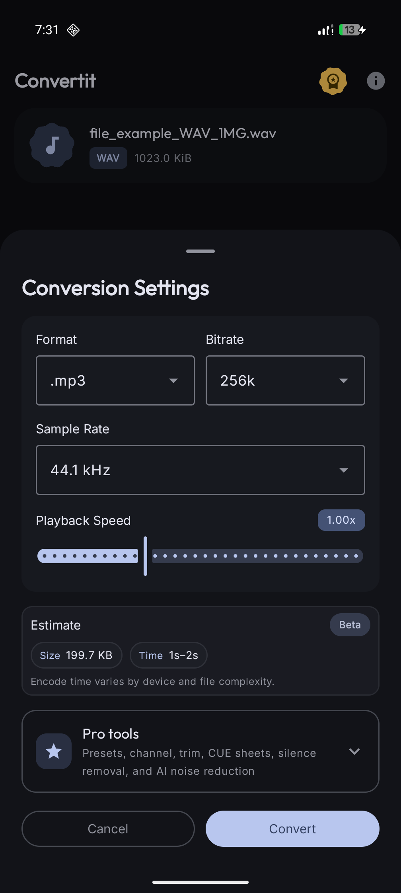
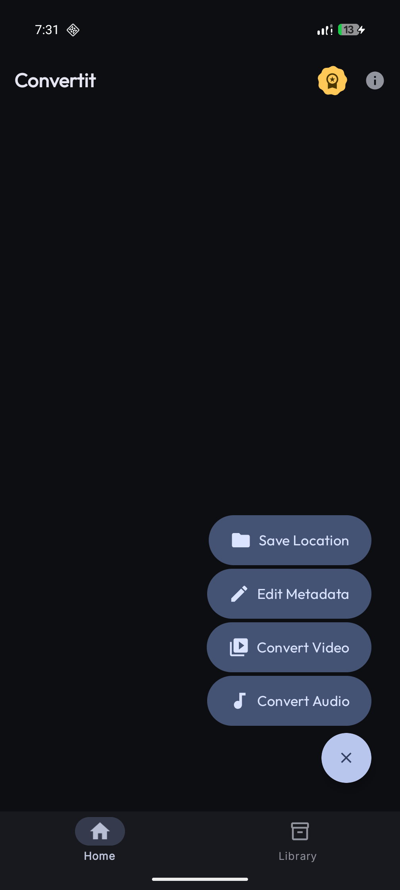
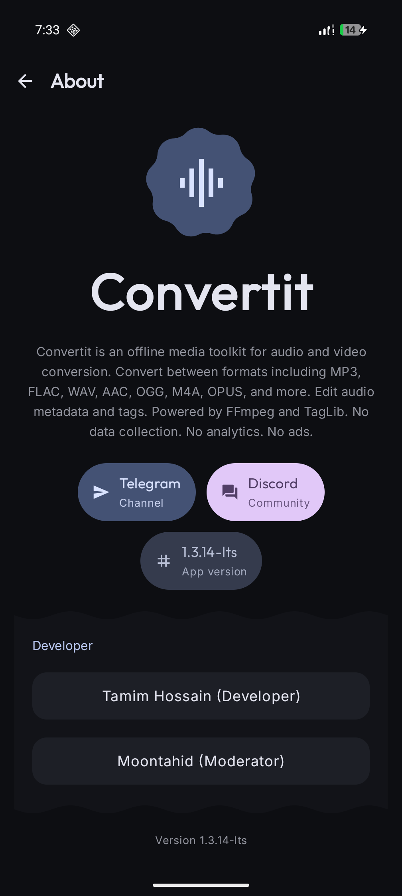

# ConvertIt® - Audio and Video Converter

ConvertIt® is an ad-free audio and video converter and metadata editor app built using Kotlin and Jetpack Compose, powered by FFmpeg and TagLib.

ConvertIt® is distributed on the Google Play Store and GitHub Releases.

## Table of Contents

* [Features](#features)
* [Screenshots](#screenshots)
* [Download](#download)
* [Certificate Fingerprints](#certificate-fingerprints)
* [Contributing](#contributing)
* [License](#license)
* [Trademark](#trademark)
* [Disclaimer](#disclaimer)

<a name="features"></a>
## Features

ConvertIt® supports a wide range of audio and video formats and provides the following features:

* Multiple formats: FLAC, MP3, WAV, AAC, OGG, M4A, AIFF, OPUS, WMA, MKA, SPX, AMRWB, and more
* Bitrate options: 9k, 16k, 24k, 32k, 48k, 64k, 96k, 128k, 192k, 256k, 320k, 512k, 768k, and 1024k
* Modern design using Material Design 3
* Ad-free experience
* User-friendly UI with simple conversion flow

<a name="screenshots"></a>
## Screenshots

<p align="center">
  
  
  
</p>

<a name="download"></a>
## Download

Download ConvertIt® from the following sources:

<p align="left">
  <a href="https://play.google.com/store/apps/details?id=com.nasahacker.convertit" target="_blank">
    
  </a>
  <br/>
  <a href="https://github.com/thebytearray/Convertit/releases" target="_blank">
    
  </a>
</p>

<a name="certificate-fingerprints"></a>
## Certificate Fingerprints for Verification

To ensure the integrity and authenticity of the app, you can verify the certificate fingerprints for the following platforms.

### GitHub

MD5 Fingerprint:
```
D2:61:D3:81:CB:02:C3:66:1B:7B:E0:D9:D0:8E:17:BA
```
SHA-1 Fingerprint:
```
34:52:C6:EF:73:DA:36:31:FA:4E:85:B7:F3:7B:6E:23:F1:64:D9:86:0D:9C:AF:6F:F1:BB:95:DC:89:D3:CF:D4
```

### Google Play Store

MD5 Fingerprint:
```
EA:4D:D4:A0:F8:26:11:E7:A7:72:6E:26:1D:A3:60:62
```
SHA-1 Fingerprint:
```
B5:53:A9:A1:8F:AF:4E:E9:3A:58:BA:45:68:1C:A4:A5:87:F4:09:A9
```
SHA-256 Fingerprint:
```
30:63:A9:0F:E1:24:58:15:66:50:46:5A:50:41:56:4A:5C:C9:96:6E:B6:8C:29:81:E0:FC:39:B6:A4:62:ED:41
```

### How to Verify the Fingerprints

1. Get the certificate fingerprint from the app or build package you are installing
2. Compare the obtained fingerprints with the ones listed above
3. Check if they match exactly

This confirms that you have the legitimate APK of ConvertIt®.

<a name="contributing"></a>
## Contributing

If you are interested in contributing to ConvertIt®, please read our [Contributing Guidelines](CONTRIBUTING.md).

<a name="license"></a>
## License

This project is licensed under the GNU General Public License v3 (GPLv3). See the [LICENSE](LICENSE) file for details.

<a name="trademark"></a>
## Trademark

"Convertit®" is a trademark of THE BYTE ARRAY LTD.

<a name="disclaimer"></a>
## Disclaimer

This software is provided "as is", without warranty of any kind, express or implied, including but not limited to the warranties of merchantability, fitness for a particular purpose, and noninfringement. In no event shall the authors or copyright holders be liable for any claim, damages, or other liability, whether in an action of contract, tort, or otherwise, arising from, out of, or in connection with the software or the use or other dealings in the software.
